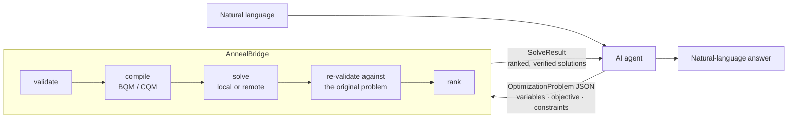

# AnnealBridge

<!-- mcp-name: io.github.TheTsungYing/annealbridge -->

[](https://github.com/TheTsungYing/AnnealBridge/actions/workflows/ci.yml)
[](https://pypi.org/project/annealbridge/)
[](https://www.python.org/downloads/)
[](https://github.com/TheTsungYing/AnnealBridge/blob/main/LICENSE)

English | [繁體中文](https://github.com/TheTsungYing/AnnealBridge/blob/main/README.zh-TW.md)

**Combinatorial optimization middleware for AI agents.** An agent describes
*what* to optimize as structured JSON; AnnealBridge decides *how* to encode
and solve it, checks every answer against the original problem, and returns
ranked, verified solutions over [MCP](https://modelcontextprotocol.io), a CLI,
or plain Python.



## Quick start

```bash
pip install annealbridge
```

A 0/1 knapsack: four items, capacity 10, maximize value. No file needed.

```python
from annealbridge.models import OptimizationProblem
from annealbridge.orchestration import OptimizationService

problem = OptimizationProblem.model_validate({
    "version": "1.0",
    "name": "knapsack",
    "variables": [{"name": n, "type": "binary"} for n in ["a", "b", "c", "d"]],
    "objective": {"direction": "maximize", "linear_terms": [
        {"variable": "a", "coefficient": 10}, {"variable": "b", "coefficient": 8},
        {"variable": "c", "coefficient": 7}, {"variable": "d", "coefficient": 6}]},
    "constraints": [{"id": "capacity", "type": "hard", "operator": "<=", "rhs": 10, "terms": [
        {"variable": "a", "coefficient": 6}, {"variable": "b", "coefficient": 5},
        {"variable": "c", "coefficient": 4}, {"variable": "d", "coefficient": 3}]}],
})

result = OptimizationService().solve(problem)
print(result.status)                        # success
print(result.solutions[0].variables)        # {'a': 1, 'b': 0, 'c': 1, 'd': 0}
print(result.solutions[0].objective_value)  # 17.0
```

Domain failures come back as results, never as exceptions: `result.status`
is one of `success`, `infeasible`, `invalid_problem`,
`resource_limit_exceeded`, `backend_unavailable`, `configuration_error` or
`solver_error`. See [docs/output-format.md](https://github.com/TheTsungYing/AnnealBridge/blob/main/docs/output-format.md).

Optional extras:

```bash
pip install "annealbridge[mcp]"       # + MCP server (annealbridge-mcp)
pip install "annealbridge[dwave]"     # + D-Wave cloud backends
pip install "annealbridge[all]"       # everything
pip install "annealbridge[gpu]"       # + PyTorch, for simulated_bifurcation on CUDA
```

`[gpu]` is deliberately **not** part of `[all]`: PyTorch is a large download,
and on Windows the wheel PyPI serves is the CPU-only build, so a CUDA run needs
`torch` installed from PyTorch's own index first — see
[docs/backends.md](https://github.com/TheTsungYing/AnnealBridge/blob/main/docs/backends.md#running-it-on-a-gpu).

## Use it from an AI agent (MCP)

With [uv](https://docs.astral.sh/uv/) installed, add the server to
`claude_desktop_config.json` (or your host's equivalent) and restart the
host. The first run fetches the package into `uvx`'s own cached environment;
that download — numpy, dimod, dwave-samplers and the rest — can take tens of
seconds, long enough for a host's start-up timeout to show the server as
disconnected. Warm the cache once in a terminal first:

```bash
uvx --from "annealbridge[mcp]" annealbridge-mcp --version
```

It resolves the environment and prints the version; from then on the host
starts from that cache.

```json
{
  "mcpServers": {
    "annealbridge": {
      "command": "uvx",
      "args": ["--from", "annealbridge[mcp]", "annealbridge-mcp"]
    }
  }
}
```

Claude Code registers it in one line:

```bash
claude mcp add annealbridge -- uvx --from "annealbridge[mcp]" annealbridge-mcp
```

Optimizing is then an ordinary chat:

> **You:** I can carry 10 kg. Item A is worth 10 and weighs 6, B is worth 8
> and weighs 5, C is worth 7 and weighs 4, D is worth 6 and weighs 3. Which
> ones should I take?

Behind the reply, the agent writes the request as problem JSON and calls
`solve_optimization`. Every solution comes back re-validated against the
original constraints, with `optimality_proven: true` on the exhaustive
`exact` backend; a document the server rejects comes back as
`invalid_problem` with every error and a fix for each, which the agent
applies before sending it again. Before solving on a remote backend, or on
a large problem, it calls `validate_optimization_problem` first, so a mistake
costs nothing; it calls `get_optimization_capabilities` when it needs the
backend list or the full schema.

> **Agent:** Take A and C: value 17 at exactly 10 kg. The runners-up are A
> and D (16, at 9 kg) and B and C (15, at 9 kg). This is the proven optimum.

The wording is the agent's; the numbers are the tool result. Another tool,
`recommend_backend`, ranks the backends for a problem and is advisory only;
when you did not name a backend and more than one local backend fits, the
server instructions tell the agent to show the top entries and ask which to
run rather than to decide for you.

**What it is not for.** AnnealBridge does not handle continuous
(real-valued) variables, non-linear objectives or non-linear constraints.
Only `exact` proves that an answer is optimal or that no feasible one
exists, and by default it takes at most 24 compiled variables (slack bits
included); the other local backends (`simulated_annealing`, `tabu`,
`simulated_bifurcation`) are heuristics whose best answer may not be the
optimum. See the
[Backends](#backends) table below and
[docs/limitations.md](https://github.com/TheTsungYing/AnnealBridge/blob/main/docs/limitations.md).

Any stdio-capable MCP host works the same way, a streamable-http transport
exists, and `pipx` or a pip-installed server behind an absolute path work in
place of `uvx`. `uvx` reuses the environment it resolved on its first run, so
a new release reaches an existing install only after `uv cache clean
annealbridge` and a host restart; see [docs/mcp.md](https://github.com/TheTsungYing/AnnealBridge/blob/main/docs/mcp.md).

## Use it from the command line

Save [the problem JSON below](#the-problem-json) as `knapsack.json`, then:

```bash
annealbridge solve knapsack.json
```

```text
Problem:   knapsack
Backend:   exact
Status:    success
Attempts:  1
Elapsed:   2.7 ms

Best solution (rank 1)
  objective (maximize):  17
  soft violation score:  0
  item_a = 1
  item_b = 0
  item_c = 1
  item_d = 0

Hard constraints: 1 / 1 satisfied
Soft constraints: 0 violations
Optimality proven: yes
```

`Elapsed` is the service's own wall clock and varies from run to run. Add
`--json` for the full `SolveResult`, `--backend simulated_annealing` to
override the backend, or try `validate`, `recommend`, `capabilities` and
`export-schema`. See [docs/cli.md](https://github.com/TheTsungYing/AnnealBridge/blob/main/docs/cli.md).

## The problem JSON

The document behind the MCP and CLI examples above, the reduced form of
[examples/knapsack.json](https://github.com/TheTsungYing/AnnealBridge/blob/main/examples/knapsack.json):

```json
{
  "version": "1.0",
  "name": "knapsack",
  "variables": [
    {"name": "item_a", "type": "binary"},
    {"name": "item_b", "type": "binary"},
    {"name": "item_c", "type": "binary"},
    {"name": "item_d", "type": "binary"}
  ],
  "objective": {
    "direction": "maximize",
    "linear_terms": [
      {"variable": "item_a", "coefficient": 10},
      {"variable": "item_b", "coefficient": 8},
      {"variable": "item_c", "coefficient": 7},
      {"variable": "item_d", "coefficient": 6}
    ]
  },
  "constraints": [
    {
      "id": "capacity",
      "type": "hard",
      "terms": [
        {"variable": "item_a", "coefficient": 6},
        {"variable": "item_b", "coefficient": 5},
        {"variable": "item_c", "coefficient": 4},
        {"variable": "item_d", "coefficient": 3}
      ],
      "operator": "<=",
      "rhs": 10
    }
  ],
  "solver": {"backend": "exact"}
}
```

Integer variables (`"type": "integer"` with bounds, `"version": "1.1"`),
quadratic objective terms, soft constraints with weights and per-backend
solver preferences are described in
[docs/problem-format.md](https://github.com/TheTsungYing/AnnealBridge/blob/main/docs/problem-format.md).
`annealbridge export-schema` prints the JSON Schema an agent can use for
structured output.

Four ready-to-run examples live in the repository —
[knapsack](https://github.com/TheTsungYing/AnnealBridge/blob/main/examples/knapsack.json),
[assignment](https://github.com/TheTsungYing/AnnealBridge/blob/main/examples/assignment.json),
[TSP](https://github.com/TheTsungYing/AnnealBridge/blob/main/examples/tsp.json) and
[integer knapsack](https://github.com/TheTsungYing/AnnealBridge/blob/main/examples/integer_knapsack.json).
The installed wheel does not ship them; take them from a checkout or from GitHub.

## How it works

The agent produces an `OptimizationProblem`: binary or bounded-integer
variables, a linear or quadratic objective, and hard or soft linear
constraints. Nothing else. AnnealBridge then, deterministically:

1. **validates** the problem and collects every error in one pass;
2. **compiles** it into a BQM or a CQM, computing penalties, slack and
   integer encodings itself;
3. **solves** it on a local or remote backend;
4. **re-validates** every candidate against the *original* JSON, never
   trusting solver energy;
5. **ranks** the feasible solutions and returns the top *K* with
   per-constraint evaluations.

The agent never writes a QUBO matrix, a penalty weight, a slack variable or
an integer encoding, and every step is testable without an AI, a network or a
vendor account.

## Backends

Eight backends sit behind one protocol.

| Backend | Kind | Path | Notes |
| --- | --- | --- | --- |
| `exact` | local | BQM | Enumerates every assignment; 24 compiled variables by default |
| `simulated_annealing` | local | BQM | Heuristic; the general-purpose choice, best of the three on small or hard-constrained problems; honours `num_reads`, `num_sweeps`, `seed` |
| `tabu` | local | BQM | Heuristic multistart tabu search, strong on dense QUBOs; the first choice once a dense problem is large; honours `num_reads`, `seed` |
| `simulated_bifurcation` | local | BQM | Heuristic dense-matrix dynamics (Goto et al. 2021), the choice for large dense unconstrained QUBOs, weaker on problems whose hard constraints compile to penalties; honours `num_reads`, `num_sweeps`, `seed`; optional CUDA via `[gpu]` |
| `dwave_qpu` | remote | BQM | D-Wave quantum annealer via `EmbeddingComposite` |
| `leap_hybrid_bqm` | remote | BQM | D-Wave Leap hybrid BQM solver |
| `leap_hybrid_cqm` | remote | CQM | D-Wave Leap hybrid CQM solver; native constraints |
| `fujitsu_da` | remote | BQM | Fujitsu Digital Annealer, QUBO API V4 over HTTPS, no SDK |

Remote backends need their vendor credential **and**
`ANNEALBRIDGE_ALLOW_REMOTE=true`; without both they report
`backend_unavailable`. `annealbridge recommend` ranks the backends for a
problem without solving it and never changes the one you asked for. Setup
and per-backend behaviour: [docs/backends.md](https://github.com/TheTsungYing/AnnealBridge/blob/main/docs/backends.md).

## Design guarantees

- **Business-level contract in both directions.** Variables, objective and
  constraints in; ranked solutions with per-constraint evaluations out. No
  solver internals leak either way.
- **Two compiler paths.** BQM (automatic penalties, binary slack, encoded
  integers) for annealers; CQM (native constraints and integers) for the
  Leap hybrid CQM solver. The backend chooses by declaring what it supports.
- **Bounded integers without exposure.** `"version": "1.1"` adds integer
  variables with the encoding hidden; `1.0` behaviour is pinned by a golden
  test.
- **Structured failures, never exceptions.** Every outcome is a `SolveResult`
  with a `status`; every failure carries a stable error code with a
  `recommended_action`. `infeasible` is an answer, not a failure.
- **No silent decisions.** An unavailable backend is reported, never swapped.
  An over-limit parameter is rejected, never clamped. An undeclared field is
  rejected, never ignored. Validator warnings travel with every solve result.
- **Safe by default.** Remote execution and remote retries are off until
  enabled; every limit is an environment variable enforced as an error; vendor
  credentials are redacted from results, logs and error messages. The
  streamable-http transport has no authentication; keep it on a private
  network. See [docs/security.md](https://github.com/TheTsungYing/AnnealBridge/blob/main/docs/security.md)
  and [SECURITY.md](https://github.com/TheTsungYing/AnnealBridge/blob/main/SECURITY.md).
- **Enforced architecture.** Import boundaries, "no backend names in the
  orchestration, validation or interface layers", and "a new backend plugs
  in without touching the pipeline" are tests, not conventions.

## Documentation

The pages below live under [docs/](https://github.com/TheTsungYing/AnnealBridge/blob/main/docs/README.md).

| Page | What it covers |
| --- | --- |
| [docs/problem-format.md](https://github.com/TheTsungYing/AnnealBridge/blob/main/docs/problem-format.md) | The input JSON: variables, objective, constraints, solver preferences |
| [docs/output-format.md](https://github.com/TheTsungYing/AnnealBridge/blob/main/docs/output-format.md) | `SolveResult` and every field it carries |
| [docs/errors.md](https://github.com/TheTsungYing/AnnealBridge/blob/main/docs/errors.md) | Error catalog, warning codes, reason codes, exit codes |
| [docs/cli.md](https://github.com/TheTsungYing/AnnealBridge/blob/main/docs/cli.md) | The `annealbridge` command line |
| [docs/mcp.md](https://github.com/TheTsungYing/AnnealBridge/blob/main/docs/mcp.md) | The MCP server, tools, host configuration, Inspector |
| [docs/backends.md](https://github.com/TheTsungYing/AnnealBridge/blob/main/docs/backends.md) | The eight backends, D-Wave and Fujitsu setup, adding a backend |
| [docs/configuration.md](https://github.com/TheTsungYing/AnnealBridge/blob/main/docs/configuration.md) | Every `ANNEALBRIDGE_*` variable and the vendor credentials |
| [docs/architecture.md](https://github.com/TheTsungYing/AnnealBridge/blob/main/docs/architecture.md) | Layers, package layout, design principles |
| [docs/security.md](https://github.com/TheTsungYing/AnnealBridge/blob/main/docs/security.md) | Defaults, limits, credential redaction, what reaches a vendor |
| [docs/testing.md](https://github.com/TheTsungYing/AnnealBridge/blob/main/docs/testing.md) | Test layout, golden tests, live tests, CI |
| [docs/limitations.md](https://github.com/TheTsungYing/AnnealBridge/blob/main/docs/limitations.md) | Known limits and what is out of scope |

## Development

```bash
git clone https://github.com/TheTsungYing/AnnealBridge.git
cd AnnealBridge
pip install -e ".[all,dev]"
pytest
```

`pytest` runs the full suite with no skip and no xfail and never touches the
network; the live vendor tests are opt-in (`pytest -m remote`). To install the
development version without a checkout:
`pip install "annealbridge[all] @ git+https://github.com/TheTsungYing/AnnealBridge.git"`.
Architecture rules, design principles and the pull-request checklist are in
[CONTRIBUTING.md](https://github.com/TheTsungYing/AnnealBridge/blob/main/CONTRIBUTING.md).

Version 0.2.1: the problem contract (`1.0` / `1.1`), the eight backends, the
CLI and the MCP tools are complete and covered by tests. What is not
supported, by design for now, is listed in
[docs/limitations.md](https://github.com/TheTsungYing/AnnealBridge/blob/main/docs/limitations.md);
changes are in [CHANGELOG.md](https://github.com/TheTsungYing/AnnealBridge/blob/main/CHANGELOG.md).

## License

[MIT](https://github.com/TheTsungYing/AnnealBridge/blob/main/LICENSE)
