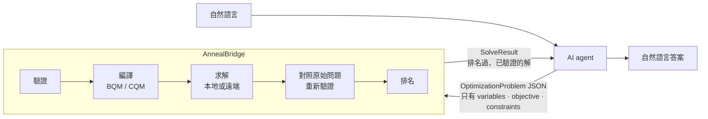

# AnnealBridge

[](https://github.com/TheTsungYing/AnnealBridge/actions/workflows/ci.yml)
[](https://pypi.org/project/annealbridge/)
[](https://www.python.org/downloads/)
[](LICENSE)

[English](README.md) | 繁體中文

**給 AI agent 使用的組合最佳化中介軟體。** agent 用結構化 JSON 描述
「要最佳化什麼」；AnnealBridge 決定「怎麼編碼與求解」，把每個答案拿回原始
問題重新檢查，再透過 [MCP](https://modelcontextprotocol.io)、CLI 或純 Python
回傳排名過、已驗證的解。



## 快速開始

```bash
pip install annealbridge
```

一個 0/1 背包問題：四個物品、容量 10、價值最大化。不需要任何檔案。

```python
from annealbridge.models import OptimizationProblem
from annealbridge.orchestration import OptimizationService

problem = OptimizationProblem.model_validate({
    "version": "1.0",
    "name": "knapsack",
    "variables": [{"name": n, "type": "binary"} for n in ["a", "b", "c", "d"]],
    "objective": {"direction": "maximize", "linear_terms": [
        {"variable": "a", "coefficient": 10}, {"variable": "b", "coefficient": 8},
        {"variable": "c", "coefficient": 7}, {"variable": "d", "coefficient": 6}]},
    "constraints": [{"id": "capacity", "type": "hard", "operator": "<=", "rhs": 10, "terms": [
        {"variable": "a", "coefficient": 6}, {"variable": "b", "coefficient": 5},
        {"variable": "c", "coefficient": 4}, {"variable": "d", "coefficient": 3}]}],
})

result = OptimizationService().solve(problem)
print(result.status)                        # success
print(result.solutions[0].variables)        # {'a': 1, 'b': 0, 'c': 1, 'd': 0}
print(result.solutions[0].objective_value)  # 17.0
```

問題本身的失敗（無效、不可行等）一律以結果回傳，不會丟出例外：
`result.status` 會是 `success`、`infeasible`、`invalid_problem`、
`resource_limit_exceeded`、`backend_unavailable`、`configuration_error` 或
`solver_error` 其中之一。見 [docs/output-format.md](docs/output-format.md)。

可選的 extras：

```bash
pip install "annealbridge[mcp]"       # + MCP server (annealbridge-mcp)
pip install "annealbridge[dwave]"     # + D-Wave cloud backends
pip install "annealbridge[all]"       # everything
pip install "annealbridge[gpu]"       # + PyTorch，讓 simulated_bifurcation 跑 CUDA
```

`[gpu]` 刻意**不**包含在 `[all]` 裡：PyTorch 體積很大，而且 Windows 上 PyPI
提供的是 CPU-only 版本，要真的用 GPU 必須先從 PyTorch 官方 index 安裝 CUDA 版
`torch` 再裝 extra — 見 [docs/backends.md](docs/backends.md#running-it-on-a-gpu)。

## 從 AI agent 使用（MCP）

裝好 [uv](https://docs.astral.sh/uv/) 之後，把 server 加進
`claude_desktop_config.json`（或你的 host 對應的設定檔），然後重新啟動
host；第一次啟動時 `uvx` 會把套件抓進它自己的快取環境。

```json
{
  "mcpServers": {
    "annealbridge": {
      "command": "uvx",
      "args": ["--from", "annealbridge[mcp]", "annealbridge-mcp"]
    }
  }
}
```

Claude Code 一行就能註冊：

```bash
claude mcp add annealbridge -- uvx --from "annealbridge[mcp]" annealbridge-mcp
```

之後最佳化就是一段普通的聊天：

> **你：** 我最多能背 10 公斤。物品 A 價值 10、重 6，B 價值 8、重 5，C 價值
> 7、重 4，D 價值 6、重 3。我該帶哪些？

在回覆背後，agent 依序呼叫三個工具：

1. `get_optimization_capabilities`：可以用哪些變數型別與運算子、哪些
   backend 可用、上限是多少。
2. `validate_optimization_problem`：它草擬的 JSON 一次拿回所有錯誤，或者
   確認沒問題。此時還沒求解，也沒花任何費用。
3. `solve_optimization`：排名過的解，每一個都對照原始限制式重新驗證過；在
   窮舉的 `exact` backend 上會帶著 `optimality_proven: true`。

> **Agent：** 帶 A 和 C：價值 17，剛好 10 公斤。次佳是 A 加 D（16，9 公斤）
> 與 B 加 C（15，9 公斤）。這是已證明的最佳解。

措辭是 agent 的，數字來自工具結果。第四個工具 `recommend_backend` 會針對
問題把 backend 排名，僅供參考。任何支援 stdio 的 MCP host 用法都相同，另外
也有 streamable-http transport；`pipx` 或用 pip 安裝後以絕對路徑指定的
server 都可以取代 `uvx`。`uvx` 會沿用第一次解析出來的環境，因此既有安裝要先
`uv cache clean annealbridge` 再重啟 host 才會換到新版；見
[docs/mcp.md](docs/mcp.md)。

## 從命令列使用

先把[下方的問題 JSON](#問題-json)存成 `knapsack.json`，然後：

```bash
annealbridge solve knapsack.json
```

```text
Problem:   knapsack
Backend:   exact
Status:    success
Attempts:  1
Elapsed:   2.7 ms

Best solution (rank 1)
  objective (maximize):  17
  soft violation score:  0
  item_a = 1
  item_b = 0
  item_c = 1
  item_d = 0

Hard constraints: 1 / 1 satisfied
Soft constraints: 0 violations
Optimality proven: yes
```

`Elapsed` 是服務端量到的實際耗時，每次執行都不一樣。加上 `--json` 可以拿到
完整的 `SolveResult`，`--backend simulated_annealing` 可以覆寫 backend，也
可以試試 `validate`、`recommend`、`capabilities` 與 `export-schema`。見
[docs/cli.md](docs/cli.md)。

## 問題 JSON

這就是上面 MCP 與命令列範例背後的文件，也是
[examples/knapsack.json](examples/knapsack.json) 的精簡版：

```json
{
  "version": "1.0",
  "name": "knapsack",
  "variables": [
    {"name": "item_a", "type": "binary"},
    {"name": "item_b", "type": "binary"},
    {"name": "item_c", "type": "binary"},
    {"name": "item_d", "type": "binary"}
  ],
  "objective": {
    "direction": "maximize",
    "linear_terms": [
      {"variable": "item_a", "coefficient": 10},
      {"variable": "item_b", "coefficient": 8},
      {"variable": "item_c", "coefficient": 7},
      {"variable": "item_d", "coefficient": 6}
    ]
  },
  "constraints": [
    {
      "id": "capacity",
      "type": "hard",
      "terms": [
        {"variable": "item_a", "coefficient": 6},
        {"variable": "item_b", "coefficient": 5},
        {"variable": "item_c", "coefficient": 4},
        {"variable": "item_d", "coefficient": 3}
      ],
      "operator": "<=",
      "rhs": 10
    }
  ],
  "solver": {"backend": "exact"}
}
```

整數變數（`"type": "integer"` 加上 bounds、`"version": "1.1"`）、二次目標
項、帶權重的 soft constraint，以及各 backend 的 solver 偏好設定，都寫在
[docs/problem-format.md](docs/problem-format.md)。
`annealbridge export-schema` 會印出 JSON Schema，agent 可以拿它來做結構化
輸出。

repository 裡有四個可直接執行的範例：[背包問題](examples/knapsack.json)、
[指派問題](examples/assignment.json)、[TSP](examples/tsp.json) 與
[整數背包問題](examples/integer_knapsack.json)。安裝後的 wheel 不含這些檔案，
請從 checkout 或 GitHub 取得。

## 運作方式

agent 產生一個 `OptimizationProblem`：binary 或有界整數變數、線性或二次的
目標函式，以及 hard 或 soft 的線性限制式。就只有這些。接著 AnnealBridge 會
以確定性的步驟：

1. **驗證**問題，一次收集所有錯誤；
2. **編譯**成 BQM 或 CQM，penalty、slack 與整數編碼都由它自己算出來；
3. 在本地或遠端 backend 上**求解**；
4. 把每個候選解拿去對照原始的 JSON **重新驗證**，絕不相信 solver 自己
   回報的 energy；
5. 把可行解**排名**，回傳前 K 名，並附上每條限制式的評估結果。

agent 永遠不必寫 QUBO 矩陣、penalty 權重、slack 變數或整數編碼，而且每一
步都能在沒有 AI、沒有網路、沒有廠商帳號的情況下測試。

## 求解器 backend

八個 backend 藏在同一套協定之後。

| Backend | 類型 | 路徑 | 說明 |
| --- | --- | --- | --- |
| `exact` | 本地 | BQM | 窮舉所有變數組合；編譯後變數預設上限 24 個（可設定） |
| `simulated_annealing` | 本地 | BQM | 啟發式；支援 `num_reads`、`num_sweeps`、`seed` |
| `tabu` | 本地 | BQM | 啟發式多起點 tabu search，對稠密 QUBO 尤其強；支援 `num_reads`、`seed` |
| `simulated_bifurcation` | 本地 | BQM | 啟發式稠密矩陣動力學（Goto et al. 2021），在大型稠密 QUBO 上最快，對小型 penalty 主導的問題較弱；支援 `num_reads`、`num_sweeps`、`seed`；可用 `[gpu]` 走 CUDA |
| `dwave_qpu` | 遠端 | BQM | 透過 `EmbeddingComposite` 使用 D-Wave 量子退火機 |
| `leap_hybrid_bqm` | 遠端 | BQM | D-Wave Leap hybrid BQM solver |
| `leap_hybrid_cqm` | 遠端 | CQM | D-Wave Leap hybrid CQM solver；原生限制式 |
| `fujitsu_da` | 遠端 | BQM | Fujitsu Digital Annealer，QUBO API V4 走 HTTPS，不需 SDK |

遠端 backend 需要對應的廠商憑證**以及**
`ANNEALBRIDGE_ALLOW_REMOTE=true`；少了任何一個都會回報
`backend_unavailable`。`annealbridge recommend` 會針對給定的問題把 backend
排名而不求解，而且絕不會改掉你指定的那一個。設定步驟與各 backend 的行為見
[docs/backends.md](docs/backends.md)。

## 設計保證

- **兩個方向都是業務層級的契約。** 輸入是變數、目標函式與限制式；輸出是排名
  過的解，附帶每條限制式的評估。兩個方向都不會洩漏 solver 內部細節。
- **兩條編譯路徑。** BQM（自動 penalty、binary slack、編碼後的整數）給退火
  機用；CQM（原生限制式與整數）給 Leap hybrid CQM solver 用。走哪一條由
  backend 宣告自己支援什麼來決定。
- **有界整數不外露。** `"version": "1.1"` 加入整數變數，編碼方式對 agent
  完全隱藏；`1.0` 的行為由 golden test 鎖定。
- **結構化的失敗，不丟例外。** 每個結果都是帶 `status` 的 `SolveResult`；
  每個失敗都帶穩定的錯誤碼與 `recommended_action`。`infeasible` 是答案，
  不是失敗。
- **不會暗中替你做決定。** backend 不可用就如實回報，絕不偷偷換掉。參數超過
  上限就直接拒絕，絕不自動改成上限值。schema 沒宣告的欄位一律拒絕，絕不
  默默忽略。validator 的 warning 會跟著每個 solve 結果一起回來。
- **預設就安全。** 遠端執行與遠端重試在啟用前都是關閉的；每一項上限都是
  環境變數，超過就回報錯誤；廠商憑證會從結果、log 與錯誤訊息中遮蔽。
  streamable-http transport 沒有任何認證，請放在私有網路內。見
  [docs/security.md](docs/security.md) 與 [SECURITY.md](SECURITY.md)。
- **架構是被強制的。** import 邊界、「orchestration、validation 與介面層
  不出現 backend 名稱」、「新增 backend 不必動到求解流程」這些都是測試，
  不是慣例。

## 文件

以下頁面都在 [docs/](docs/README.md) 之下。

| 頁面 | 內容 |
| --- | --- |
| [docs/problem-format.md](docs/problem-format.md) | 輸入 JSON：變數、目標函式、限制式、solver 偏好設定 |
| [docs/output-format.md](docs/output-format.md) | `SolveResult` 以及它帶的每一個欄位 |
| [docs/errors.md](docs/errors.md) | 錯誤碼清單、warning code、reason code、exit code |
| [docs/cli.md](docs/cli.md) | `annealbridge` 命令列 |
| [docs/mcp.md](docs/mcp.md) | MCP server、工具、host 設定、Inspector |
| [docs/backends.md](docs/backends.md) | 八個 backend、D-Wave 與 Fujitsu 設定、如何新增 backend |
| [docs/configuration.md](docs/configuration.md) | 每一個 `ANNEALBRIDGE_*` 變數與廠商憑證 |
| [docs/architecture.md](docs/architecture.md) | 分層、套件結構、設計原則 |
| [docs/security.md](docs/security.md) | 預設值、上限、憑證遮蔽、有哪些資料會送到廠商端 |
| [docs/testing.md](docs/testing.md) | 測試結構、golden test、live test、CI |
| [docs/limitations.md](docs/limitations.md) | 已知限制與哪些東西不在範圍內 |

## 開發

```bash
git clone https://github.com/TheTsungYing/AnnealBridge.git
cd AnnealBridge
pip install -e ".[all,dev]"
pytest
```

`pytest` 會跑完整組測試，沒有 skip、沒有 xfail，也完全不碰網路；對廠商的
live 測試要自己指定才會跑（`pytest -m remote`）。不用 checkout 也能安裝開發
版本：
`pip install "annealbridge[all] @ git+https://github.com/TheTsungYing/AnnealBridge.git"`。
架構規則、設計原則與 pull request 檢查清單都在
[CONTRIBUTING.md](CONTRIBUTING.md)。

版本 0.2.1：問題契約（`1.0` / `1.1`）、八個 backend、CLI 與 MCP 工具都已
完成並有測試涵蓋。目前刻意不支援的項目列在
[docs/limitations.md](docs/limitations.md)；變更紀錄見
[CHANGELOG.md](CHANGELOG.md)。

## 授權

[MIT](LICENSE)
